# basic_layout_flutter

A new Flutter project.

## Hello World

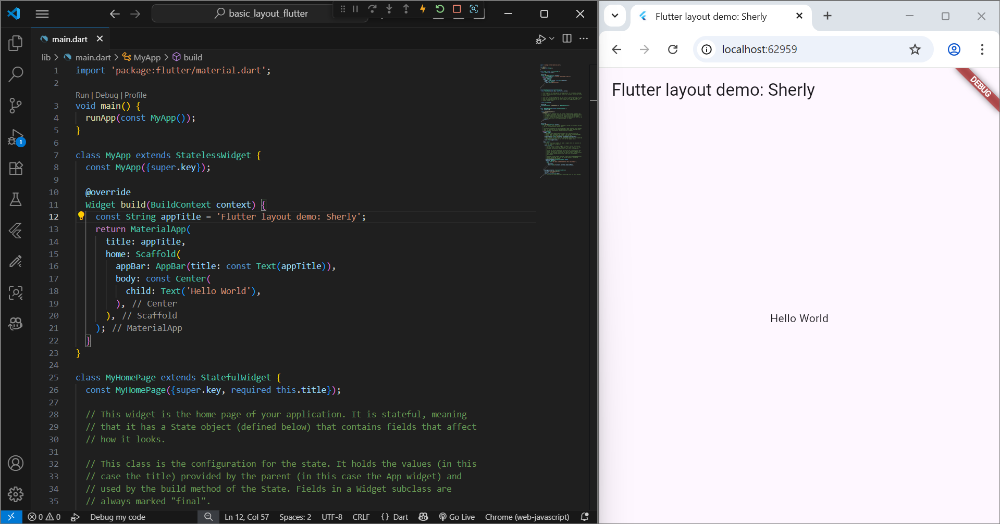

The initial display of a simple Flutter build showing the text “Hello World” with the title Flutter layout demo: Sherly.

## Row

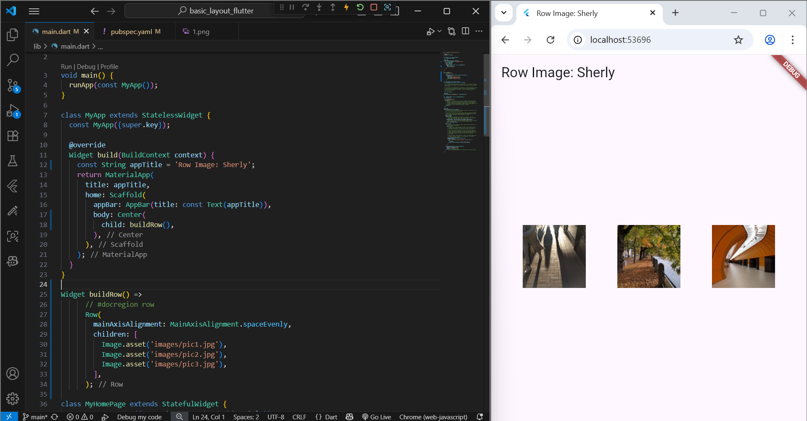

Basic example of using Row to arrange widgets horizontally.

## Column

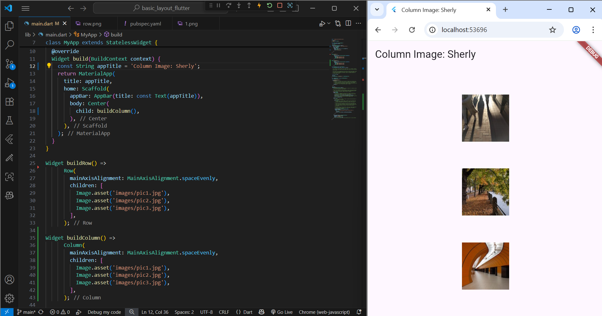

Example of using Column to arrange widgets vertically on the screen.

## Row with Expanded Widget

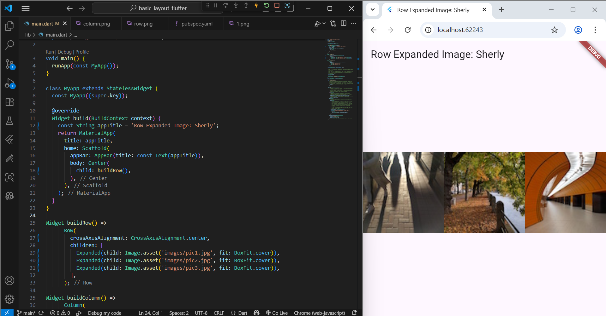

This is the example of using Row with Expanded to proportionally distribute space between elements.

## Expanded Row with Flex

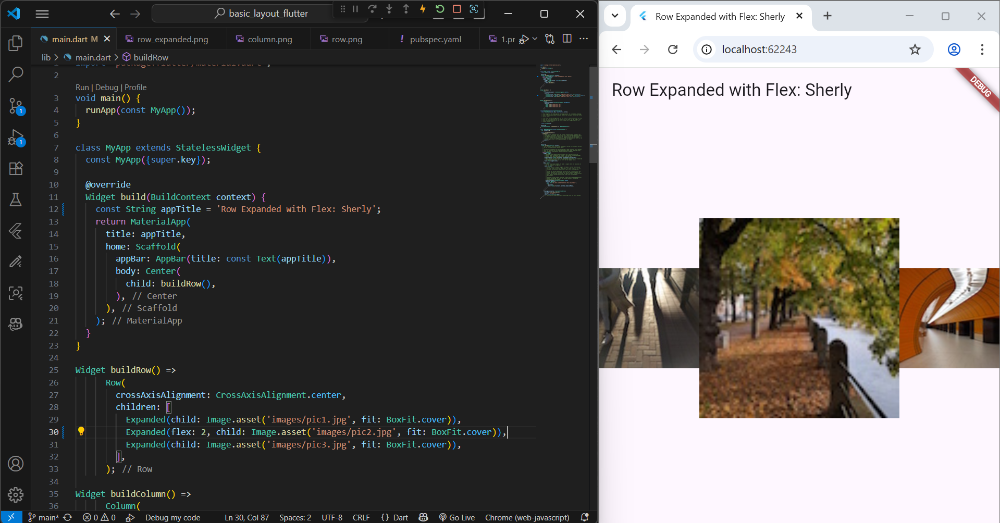

Example of applying Expanded and Flex to adjust space proportions among widgets inside the Row.

## Rating with Stars

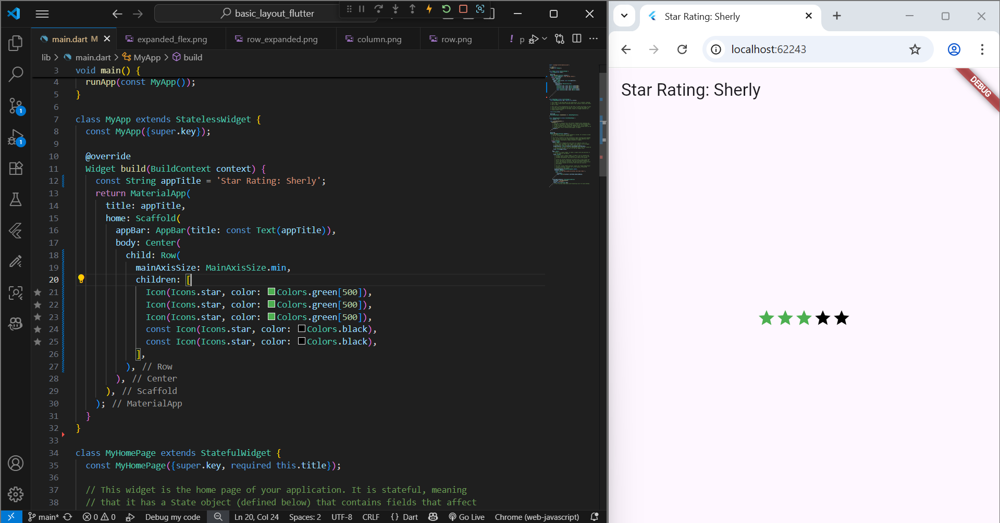

Example for displaying a rating system using star icons (Icon(Icons.star)).

## Rating with Stars and Review

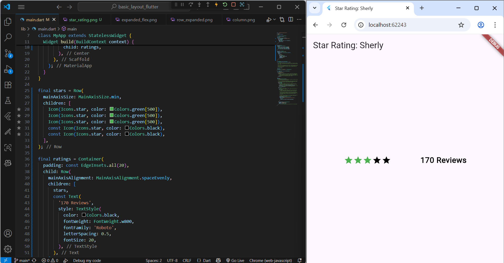

Complete version of the star rating layout showing stars and number of reviews.

## Rating with Additional Info

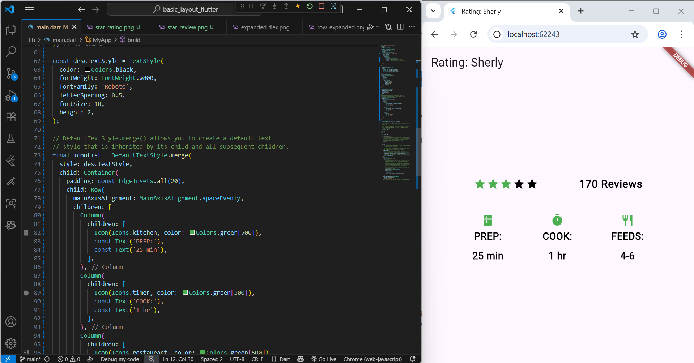

This practicum shows how to build a rating layout using Row and Column in Flutter. It displays stars, reviews, and cooking info.

## Pavlova

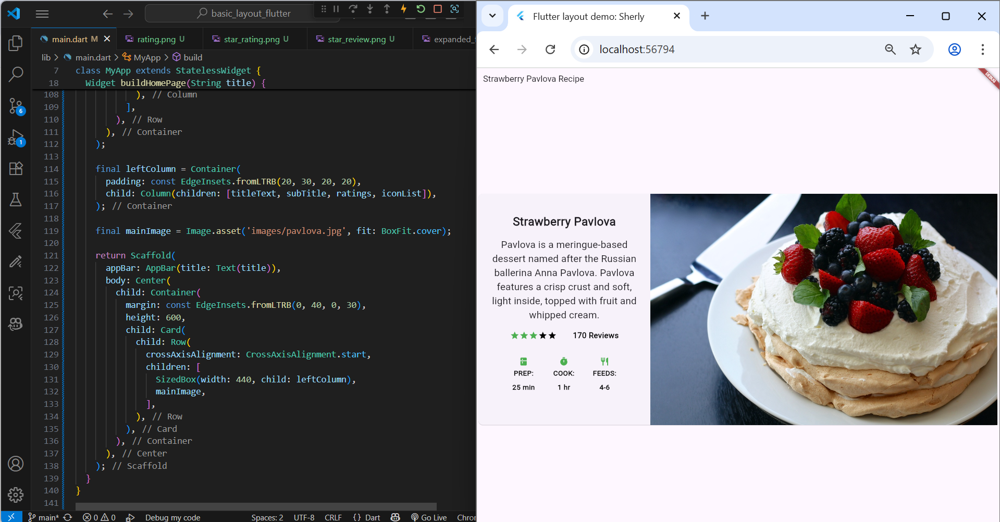

This practicum for creating the “Strawberry Pavlova” recipe layout using a combination of Column, Row, and Container.

## Responsive Pavlova

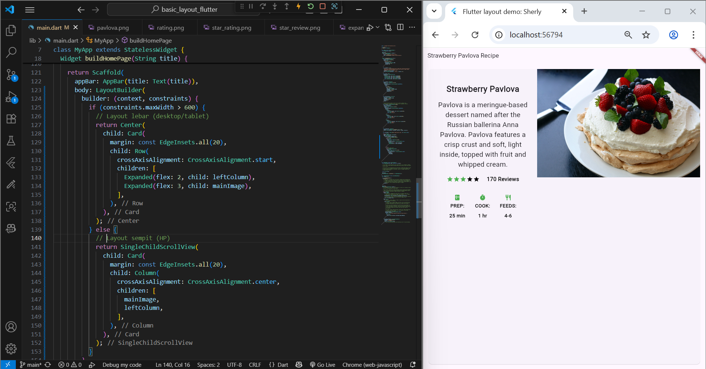

Responsive version of the Pavlova layout so it adapts to different screen sizes.

## Container

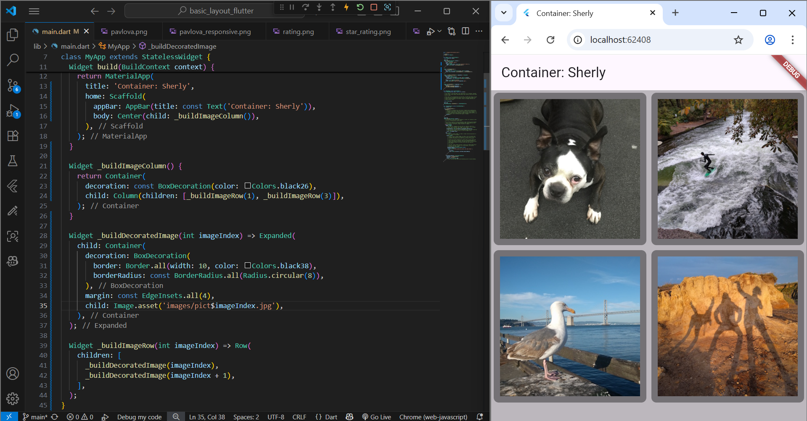

This is the example of using Container to set padding, margin, color, or widget size.

## GridView

This example demonstrates how to create a structured image gallery using the GridView widget. The layout arranges multiple images into a grid format with equal spacing, making it easy to display collections of photos or cards.

## ListView

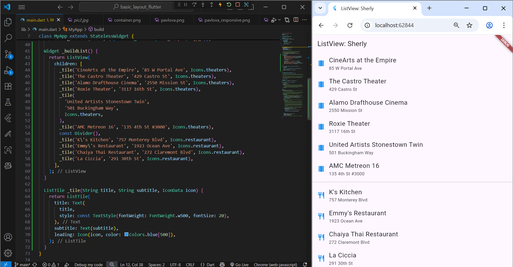

This example demonstrates how to display a scrollable list of items using the ListView widget. Each item can contain text, images, or even complex widgets. ListView automatically adds vertical scrolling when the content exceeds the screen height.

## Stack

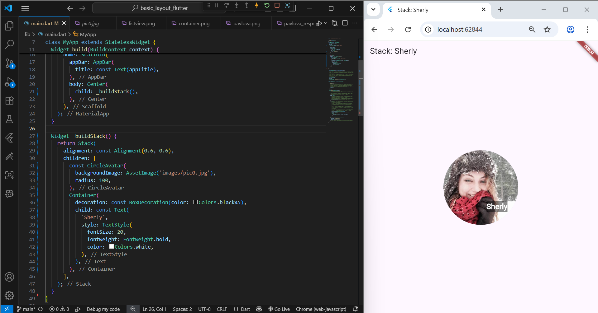

This example demonstrates how to use the Stack widget to overlay multiple widgets on top of each other. The layout places a circular profile image as the base layer, with a text label (“Sherly”) positioned above it.

## Card

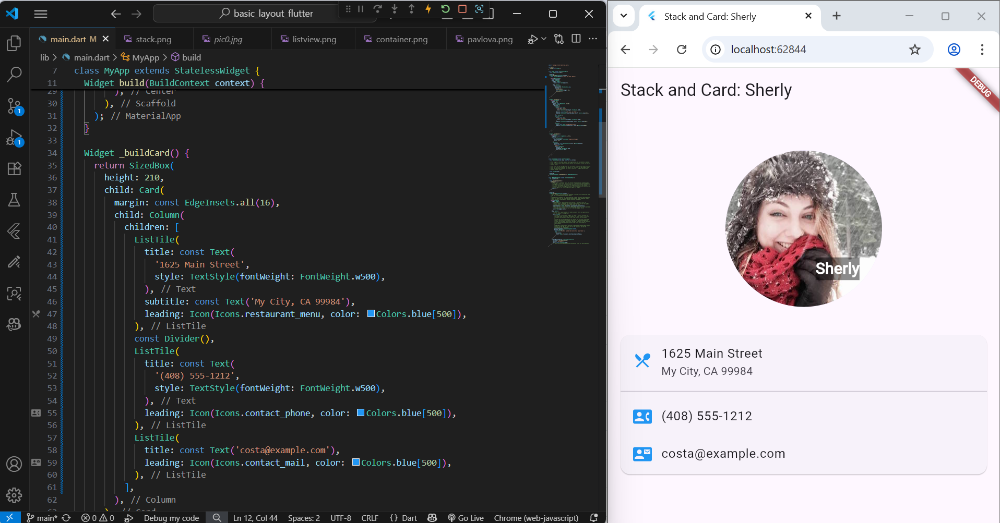

This example combines the Stack and Card widgets to create a clean, modern profile interface. The circular image with a text overlay (“Sherly”) is built using Stack, while contact information is organized neatly inside Card widgets below the image.
